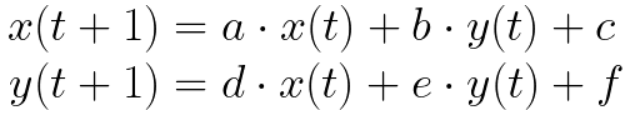
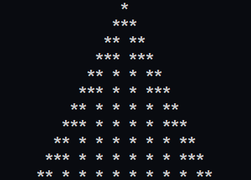
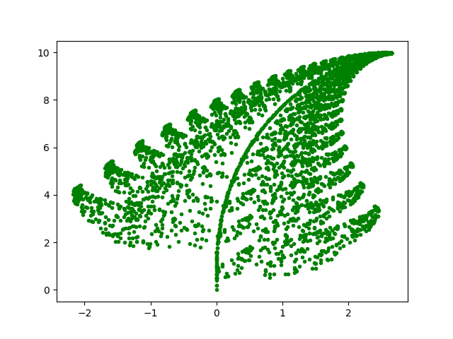

# Patterns

## Interesting pattern generators

### 1. Prerequisites:

- `matplotlib`

### 2. Classes:

- `NumberPattern` - class to create patterns using `rule` which is 8-bit number. Class contains list of values (`1` or `0`) and prints `1` as "`*`" and `0` as " ". It creates new row using rules:

  | 111 | 110 | 101 | 100 | 011 | 010 | 001 | 000 |
  | --- | --- | --- | --- | --- | --- | --- | --- |
  | 0   | 0   | 0   | 0   | 0   | 0   | 1   | 1   |

  It is `rule` number where bit position is represented as 3-bit number. When it creates new row it checks previous value and neighbour values. `010` means that left and right neighbour had value 0 and previous value was 1.

- `FuncitonPattern` - class to create patterns using sets of parametes and probabilieties to choose one of the set. It genrate new coordinates using previous ones:
  
  

### 3. Examples:

- `NumberPattern` :

  

- `FunctionPattern` :

  
